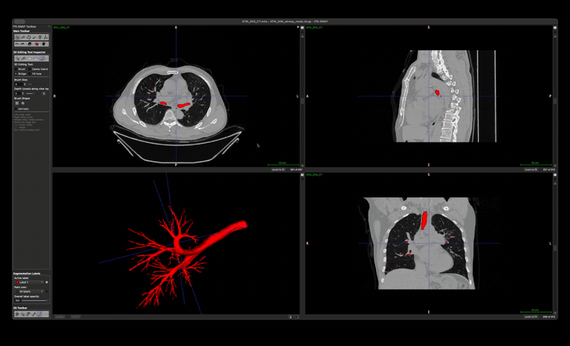

# ITK-SNAP 3D Editing Tool

A fork of [ITK-SNAP](https://github.com/pyushkevich/itksnap) that adds **segmentation editing
directly in the 3D view**.

ITK-SNAP lets you paint a segmentation slice by slice in the 2D views and then render it as a 3D
surface. Until now, fixing a mistake you can only *see* in 3D — a floating fragment, a leak, a hole,
a branch that broke off — meant hunting back through 2D slices to find the voxels responsible.

This fork lets you fix those defects where you see them.



> **Note:** the demo above shows the tool on a pediatric chest CT airway segmentation, which is the
> workflow it was built for. Nothing about it is airway-specific.

---

## What it adds

A new **3D Editing Tool** in the 3D view toolbar, with four sub-tools:

| Sub-tool | What it does |
|---|---|
| **Brush** | Left-drag paints on the rendered surface, right-drag erases. Radius down to a single voxel. |
| **Delete island** | Click a disconnected fragment and its entire connected component is removed. |
| **Bridge** | Click two points to join separated structures with a tube. |
| **Fill hole** | Click a gap to close it with a local morphological closing. |

### Why the brush can *add* material

The picking is the interesting part. ITK-SNAP's existing 3D tools locate a click by ray-marching the
label image, which can only ever return a voxel that is *already labeled* — which is why the existing
spray tool can only thicken a structure by one voxel and can never bridge a gap.

This tool picks against the **rendered mesh** with a `vtkCellPicker` instead. The hit point lies on
the marching-cubes isosurface, i.e. *between* labeled and unlabeled voxels, so a ball centred there
covers unlabeled voxels and the surface advances outward. Dragging unions successive stamps into a
tube, which is what makes it possible to draw across a gap.

The old ray-march is kept as a fallback for when the mesh is stale or absent — for example right
after painting in 2D, before you press **Update**.

### Controls

| Input | Action |
|---|---|
| Left-drag | Paint |
| Right-drag | Erase |
| Middle-drag | Rotate camera |
| Shift / Ctrl + left-drag | Pan / spin camera |
| Wheel | Zoom |
| `[` `]` | Brush size |
| `,` `.` | Depth along the view ray |
| `Esc` | Cancel a pending bridge endpoint |
| `Ctrl+Z` / `Cmd+Z` | Undo — one step per stroke |

A wireframe sphere follows the cursor showing the footprint that will actually be painted.

Nothing is bound to <kbd>Alt</kbd>, and no binding *requires* the mouse wheel, because ITK-SNAP's
offscreen (OSMesa) widget backend forwards only Ctrl and Shift and has no wheel handler.

### Notes on behaviour

- **Set an active drawing label first.** The additive tools paint with the active label, so with
  "Clear Label" selected they would erase rather than add. The tool refuses and explains instead.
- **Undo is per stroke**, and while the tool is active the 3D mesh refreshes on every change,
  including undo and redo.
- **Delete island asks before deleting anything large** (over 20 000 voxels), so a misclick on the
  main structure cannot silently wipe it out.
- **Isotropic mode is off by default**, matching the 2D paintbrush. With it on, the radius is
  measured in units of the *smallest* voxel spacing, which on a typical chest CT (~0.9 × 0.9 × 0.5 mm)
  collapses a small brush into a needle along z.

### Current limitation

After each edit the mesh is rebuilt in full, which takes a few seconds on a large structure. A
localized re-mesh (marching cubes over only the edited region, spliced into the cached surface) is
designed but not yet implemented.

---

## Installing

There are no prebuilt binaries yet — build from source. The build is the standard ITK-SNAP build; the
tool adds no new dependencies.

### Requirements

| | Version | Notes |
|---|---|---|
| CMake | ≥ 3.16 | |
| C++ | C++17 | |
| **ITK** | 5.4.0 | Must be built with `Module_MorphologicalContourInterpolation=ON` |
| **VTK** | 9.5.2 | Must be built with Qt support and `RenderingExternal` |
| **Qt** | 6.8.1 or newer | Needs `qtbase`, `qtdeclarative` (for Qt6Qml) and `qttools` (for LinguistTools) |
| libssh, libcurl | any recent | |

**Do not use a distribution's packaged ITK.** ITK-SNAP requires the
`MorphologicalContourInterpolation` remote module, which is off by default and is not enabled in
Homebrew's or apt's ITK builds. VTK likewise needs `VTK_GROUP_ENABLE_Qt=YES`, which packaged builds
often omit.

These versions match ITK-SNAP's own CI. Newer Qt works — this fork was developed and tested against
Homebrew's Qt 6.11.

### 1. Clone

```sh
git clone https://github.com/HUmutI/itksnap-3d-edit.git
cd itksnap-3d-edit
git submodule update --init --recursive
```

The submodules (`c3d`, `greedy`, `digestible`) are required; the build fails without them.

### 2. Build ITK and VTK

Same for all platforms apart from the generator. Build these once; they take considerably longer than
ITK-SNAP itself.

```sh
# VTK 9.5.2
git clone --depth 1 --branch v9.5.2 --recurse-submodules \
    https://gitlab.kitware.com/vtk/vtk.git vtk-src
cmake -S vtk-src -B vtk-build -G Ninja \
  -DCMAKE_BUILD_TYPE=Release \
  -DBUILD_TESTING=OFF -DBUILD_EXAMPLES=OFF -DBUILD_SHARED_LIBS=OFF \
  -DVTK_GROUP_ENABLE_Qt=YES \
  -DVTK_MODULE_ENABLE_VTK_RenderingExternal=WANT \
  -DVTK_MODULE_ENABLE_VTK_GUISupportQtQuick=NO \
  -DVTK_MODULE_ENABLE_VTK_GUISupportQtSQL=NO \
  -DCMAKE_INSTALL_PREFIX=$PWD/vtk-install
cmake --build vtk-build --target install --parallel

# ITK 5.4.0
git clone --depth 1 --branch v5.4.0 \
    https://github.com/InsightSoftwareConsortium/ITK.git itk-src
cmake -S itk-src -B itk-build -G Ninja \
  -DCMAKE_BUILD_TYPE=Release \
  -DBUILD_TESTING=OFF -DBUILD_EXAMPLES=OFF -DBUILD_SHARED_LIBS=OFF \
  -DModule_MorphologicalContourInterpolation=ON
cmake --build itk-build --parallel
```

`ITK_DIR` points at the ITK **build** directory, not an install prefix — ITK's install step misses a
header (`vnl_vector_ref.hxx`), which is why ITK-SNAP's own CI does the same.

### 3. Build ITK-SNAP

<details open>
<summary><b>macOS</b> (verified on Apple Silicon, macOS 26)</summary>

```sh
brew install cmake ninja qtbase qtdeclarative qttools libssh

cmake -S itksnap-3d-edit -B itksnap-build -G Ninja \
  -DCMAKE_BUILD_TYPE=Release \
  -DITK_DIR=$PWD/itk-build \
  -DVTK_DIR=$PWD/vtk-install/lib/cmake/vtk-9.5 \
  -DQt6_DIR=/opt/homebrew/lib/cmake/Qt6
cmake --build itksnap-build --parallel
```

The binary is `itksnap-build/ITK-SNAP`. To produce an `.app` bundle:

```sh
cmake --build itksnap-build --target package
```

CPack stages the bundle at
`itksnap-build/_CPack_Packages/Darwin-arm64/Bundle/itksnap-*/ITK-SNAP.app`. The final `.dmg` step
drives Finder via AppleScript and often fails on a headless or automated session — the `.app` itself
is complete regardless.

Because CPack rewrites library paths with `install_name_tool`, the bundle's code signature is
invalidated and macOS will kill it on launch. Re-sign it:

```sh
ditto --norsrc --noextattr --noqtn \
  itksnap-build/_CPack_Packages/Darwin-arm64/Bundle/itksnap-*/ITK-SNAP.app \
  ~/Applications/ITK-SNAP.app
codesign --force --deep --sign - ~/Applications/ITK-SNAP.app
```

Do not stage the bundle inside an iCloud-synced folder such as `~/Desktop` or `~/Documents`. iCloud
sets `com.apple.FinderInfo` on the bundle directories, and `codesign` then refuses with
*"resource fork, Finder information, or similar detritus not allowed"*.
</details>

<details>
<summary><b>Ubuntu / Linux</b></summary>

```sh
sudo apt install build-essential cmake ninja-build \
  qt6-base-dev qt6-declarative-dev qt6-tools-dev qt6-tools-dev-tools \
  libssh-dev libcurl4-openssl-dev libgl1-mesa-dev

cmake -S itksnap-3d-edit -B itksnap-build -G Ninja \
  -DCMAKE_BUILD_TYPE=Release \
  -DITK_DIR=$PWD/itk-build \
  -DVTK_DIR=$PWD/vtk-install/lib/cmake/vtk-9.5
cmake --build itksnap-build --parallel
```

If your distribution's Qt is older than 6.8, install Qt with
[`aqtinstall`](https://github.com/miurahr/aqtinstall) and pass
`-DQt6_DIR=<qt>/lib/cmake/Qt6`.

Headless test runs need a display: `xvfb-run -a ctest`.
</details>

<details>
<summary><b>Windows</b></summary>

Use a *Developer Command Prompt for VS 2022*, or run `vcvars64.bat` first.

```bat
:: libcurl and libssh via vcpkg
vcpkg install curl libssh zlib --triplet x64-windows-release

cmake -S itksnap-3d-edit -B itksnap-build -G Ninja ^
  -DCMAKE_BUILD_TYPE=Release ^
  -DITK_DIR=%CD%\itk-build ^
  -DVTK_DIR=%CD%\vtk-install\lib\cmake\vtk-9.5 ^
  -DQt6_DIR=C:\Qt\6.8.1\msvc2022_64\lib\cmake\Qt6 ^
  -DCMAKE_TOOLCHAIN_FILE=<vcpkg>\scripts\buildsystems\vcpkg.cmake
cmake --build itksnap-build --parallel
```

Build VTK with `-DVTK_SMP_ENABLE_STDTHREAD=OFF`, and ITK with
`-DCMAKE_EXE_LINKER_FLAGS=/FORCE:MULTIPLE -DCMAKE_EXE_SHARED_FLAGS=/FORCE:MULTIPLE` — both are
workarounds ITK-SNAP's CI applies for these exact versions.

An NSIS installer can be produced with `cmake --build itksnap-build --target package`.
</details>

### 4. Verify

```sh
cd itksnap-build
ctest -E RemoteImageLoad     # the excluded tests need network access
```

---

## Using the tool

1. Open your image (**File → Open Main Image**) and segmentation
   (**Segmentation → Open Segmentation**).
2. Pick your label under **Segmentation Labels → Active label**.
3. Press **update** in the 3D panel to build the mesh.
4. Choose the tool: **Tools → Active 3D Tool → 3D Editing Tool**, or the button in the left panel's
   3D toolbox.
5. Select a sub-tool in the inspector panel and edit.

### If parts look disconnected but the tools disagree

ITK-SNAP applies Gaussian smoothing (σ = 0.8 by default) before marching cubes. Connections that are
one voxel thick fall below the isosurface threshold and vanish from the rendering, so a structure can
*look* broken while its voxels are still connected — in which case **Delete island** will correctly
report the whole structure as one component.

To see the true voxel topology, turn Gaussian smoothing off under
**Preferences → 3D Rendering**, then press **update**.

To check from the command line, using the `c3d` binary this repository builds:

```sh
c3d your_mask.nii.gz -comp -dup -lstat
```

The component sizes tell you immediately whether a fragment is genuinely separate.

---

## Licence and attribution

ITK-SNAP is licensed under the **GNU General Public License v3.0** — see [COPYING](COPYING). This
fork is distributed under the same licence.

All credit for ITK-SNAP itself belongs to Paul A. Yushkevich, Guido Gerig and the many contributors
listed on the [ITK-SNAP credits page](http://itksnap.org/credits.php). The upstream project's README
is preserved here as [README.upstream.md](README.upstream.md).

If you use ITK-SNAP in published work, please cite:

> Paul A. Yushkevich, Joseph Piven, Heather Cody Hazlett, Rachel Gimpel Smith, Sean Ho, James C. Gee,
> and Guido Gerig. *User-guided 3D active contour segmentation of anatomical structures:
> Significantly improved efficiency and reliability.* Neuroimage. 2006 Jul 1; 31(3):1116-28.

This fork is not affiliated with or endorsed by the ITK-SNAP project, and the changes here have not
been submitted upstream.
